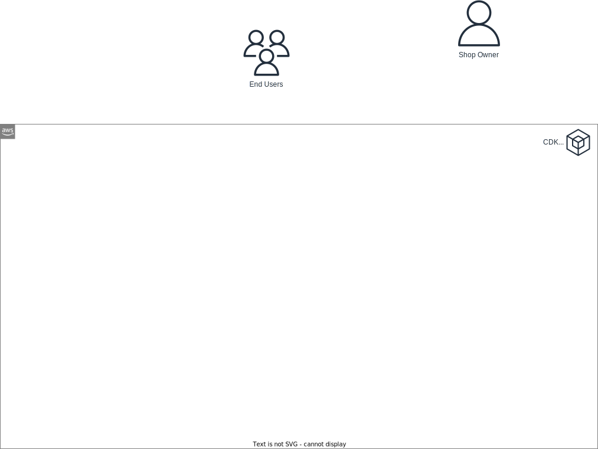

# Introduction

Embark on a structured AWS serverless training journey. Each phase will introduce theoretical concepts backed by an assortment of resources like reference documents, book excerpts, tutorials, and videos. To complement the theoretical grounding, we'll develop an *Online Shop* application in parallel.

A basic understanding of TypeScript and NodeJS is beneficial. If needed, you might want to review the [NodeJS training](https://github.com/msg-CareerPaths/nodejs-training) as a primer.

**Target Audience:**  
Engineers seeking proficiency in AWS serverless development, with an emphasis on using AWS CDK for infrastructure orchestration.

**Training Rules:**  
- Infrastructure should be exclusively created or updated via CDK.
- Record your progress by setting up a fresh GitHub repository. 
- Perform a commit with the code changes after you complete each chapter.
- Independence in research and troubleshooting is needed. The training will NOT spoon feed you the necessary steps at each phase. 

## Required Reading
- [Getting Started with AWS Cloud Essentials (amazon.com)](https://aws.amazon.com/getting-started/cloud-essentials/)
- [Global Infrastructure Overview (amazon.com)](https://aws.amazon.com/about-aws/global-infrastructure/)
- [Regions & AZs (amazon.com)](https://aws.amazon.com/about-aws/global-infrastructure/regions_az/)
- [Serverless on AWS (amazon.com)](https://aws.amazon.com/serverless/)
- [Starting a New Project - AWS CDK Workshop](https://cdkworkshop.com/20-typescript/20-create-project.html) (Only the "New Project" chapter)

## Online Shop

### Data Model
Begin by understanding the data schema of the online shop:

*Note: Disregard the Locations entity for this exercise. Let's assume our shop operates from a single location with an unlimited stock of products.*

### Environment Setup
Configure your development environment:
- [Set up a new AWS account](https://docs.aws.amazon.com/AWSEC2/latest/UserGuide/get-set-up-for-amazon-ec2.html#sign-up-for-aws). Alternatively, use an existing personal or company-provided account.
- Use the "us-east-1" region for your infrastructure.
- Ensure you have Node 16 (or its newer versions) and Docker installed on your machine.
- [Initialize a new "OnlineShop" CDK app](https://cdkworkshop.com/20-typescript/20-create-project/100-cdk-init.html) and, if you haven't already, [bootstrap CDK on your AWS account & region](https://cdkworkshop.com/20-typescript/20-create-project/500-deploy.html#bootstrapping-an-environment).