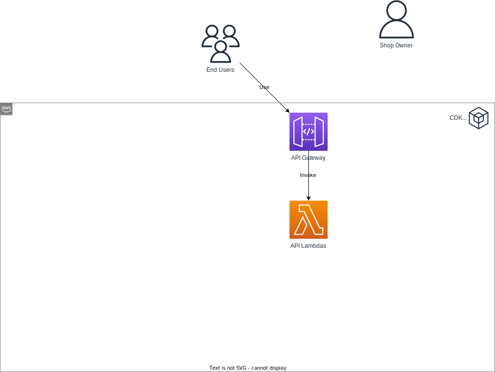

# API Gateway and Lambda

**Goal**: Develop a serverless API Gateway utilizing Lambda's capabilities.

## Required Reading

- [AWS CDK Workshop](https://cdkworkshop.com/20-typescript/30-hello-cdk.html) (Only the "Hello, CDK!" and "Writing constructs" chapters)

## Online Shop

### Setting Up API Gateway V2 ("HTTP API")
Configure an API Gateway to surface products and their corresponding categories with the operations detailed below:
 - Fetch all categories
 - Retrieve a specific category using its ID
 - List all products under a specific category (passed by ID)
 - Obtain details of a product via its ID
 - Add a new product under a specified category using the category ID
 - Modify product details using its ID
 - Remove a product using its ID

### Organizing Lambda Functions
For each of the API operations, create a dedicated Lambda function. Structure your Lambda codebase using the following directories:
 - `models`: Contains interfaces to model essential entities.
 - `repositories`: Houses classes for data retrieval. Initially, employ mock or in-memory storage within these repositories (this will be iterated upon in subsequent chapters).
 - `services`: Consists of classes that house the core business logic, solely leveraging repositories for data extraction.
 - `handlers`: Each Lambda should have a unique file in this directory. Every file should contain a handler function that brings to life the corresponding service class and invokes the necessary service method.

### Input Validation and Handling
In the `handlers`, ensure you validate API Gateway input using the [zod](https://www.npmjs.com/package/zod) library. The zod schemas can also assist in defining your `models` through [inference](https://www.npmjs.com/package/zod#type-inference).

### Testing

After implementation, use an API Client (options include Postman or the AWS Console) to test your API endpoints.

## Additional Resources

- [Building a serverless application with the AWS CDK](https://docs.aws.amazon.com/cdk/v2/guide/serverless_example.html)
- [A Comprehensive Guide to Writing TypeScript Lambda functions in AWS CDK](https://bobbyhadz.com/blog/aws-cdk-typescript-lambda)
