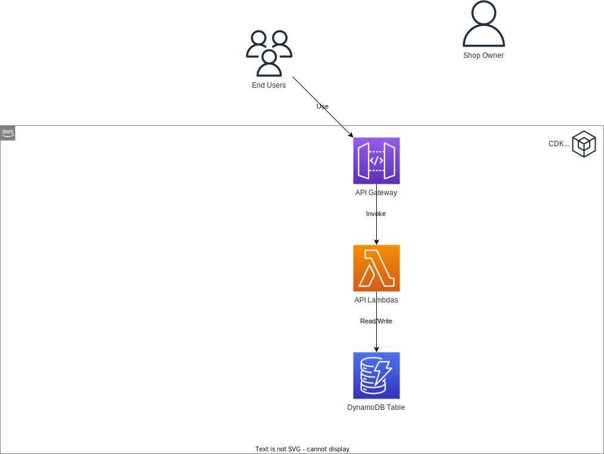

# DynamoDB Migrations

**Goal**: Implement iterative enhancements to the DynamoDB data model.

## Required Reading

- [OneTable CLI for DynamoDB Migration](https://www.sensedeep.com/blog/posts/2021/onetable-cli.html)

## Online Shop

### Introducing the Supplier Entity
Add a new entity named 'Supplier' into your DynamoDB table and seed the related mock data. Create a new Global Secondary Index (GSI2) to allow reading products by the supplier (e.g., GSI2PK = "SUPPLIER#XYZ", GSI2SK = "PRODUCT#ABC"). Use a DynamoDB migration to populate the PK and SK of this GSI based on existing product data.

### API Integration with Supplier Entity
Construct new APIs facilitating the following actions:
- Retrieve all suppliers.
- Fetch a specific supplier based on its ID.
- List all products associated with a specific supplier, using its ID (using GSI2).

### Testing

Invoke the new APIs to ensure that they work consistently.

## Further Resources

- [Migrating Data Structures in DynamoDB](https://spin.atomicobject.com/2020/10/20/dynamodb-migrate-data-structures/)
- [DynamoDB OneTable Migration Library](https://github.com/sensedeep/onetable-migrate/blob/main/README.md)
- [Best Practices for Secondary Indexes with DynamoDB](https://www.trek10.com/blog/best-practices-for-secondary-indexes-with-dynamodb) 
