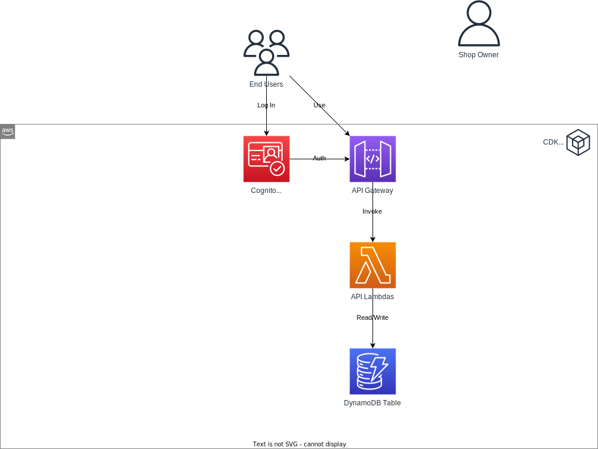

# Authentication using Cognito

**Goal**: Integrate authentication functionality with Amazon Cognito.

## Required Reading

- [What is Amazon Cognito?](https://docs.aws.amazon.com/cognito/latest/developerguide/what-is-amazon-cognito.html)
- [Control access to a REST API using Amazon Cognito user pools as authorizer](https://docs.aws.amazon.com/apigateway/latest/developerguide/apigateway-integrate-with-cognito.html)

## Online Shop

### Setting up Cognito User Pool and App Client

- **User Pool Creation**: Establish a new Cognito User Pool. 
- **App Client Configuration**: Set up an App Client within this pool. Use this App Client in your API Client to obtain authentication tokens.

### User Group Integration

- **User Creation**: Create multiple user profiles within your User Pool.
- **Group Creation**: Organize these users into two distinct groups:
   - Customers
   - Admins

### API Gateway and Cognito Integration

- **Authorization**: Designate the User Pool as the authorizer for the API Gateway.
- **Lambda Adjustments**: Modify your Lambdas to validate the Cognito user group. This information is passed during the Lambda invocation process. Ensure that:
   - Admins retain the authority to create, update, or delete products.
   - Customers are restricted from these operations. If attempted, respond with an appropriate status code.

### Testing

To ensure the accurate functioning of your authentication:

1. **Admin Scenarios**: 
   - Authenticate as an admin.
   - Try creating, updating, and deleting products. This should succeed without issues.
   - Fetch products to ensure the changes took effect.

2. **Customer Scenarios**: 
   - Authenticate as a customer.
   - Try creating, updating, or deleting products. This should result in an error.
   - Fetch products; this should work without any issues.

3. **Unauthenticated Scenarios**: 
   - Without logging in, try to fetch products. This should result in an error.
   - Any attempts to modify (create, update, or delete) products should result in authentication errors.

## Further Resources

- [Amazon Cognito Workshop > Lab 1 - User Pools API Authentication](https://www.cognitobuilders.training/20-lab1/)
- [Cognito User Pool Example in AWS CDK - Complete Guide](https://bobbyhadz.com/blog/aws-cdk-cognito-user-pool-example)
