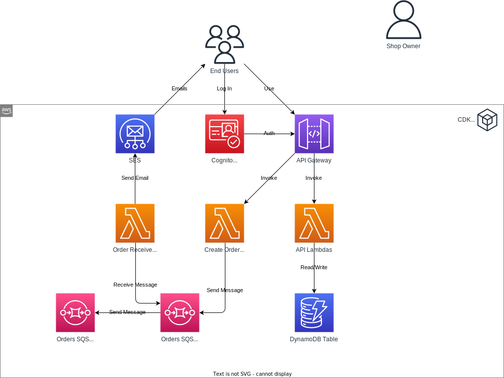

# Background Processing using SQS

**Goal:** Implement a system to process orders asynchronously using Amazon SQS and send order confirmation emails to customers via Amazon SES.

## Required Reading

- [Getting started with Amazon SQS](https://docs.aws.amazon.com/AWSSimpleQueueService/latest/SQSDeveloperGuide/sqs-getting-started.html)
- [How do I send email using Lambda and Amazon SES?](https://repost.aws/knowledge-center/lambda-send-email-sesl)
- [Using Lambda with Amazon SQS](https://docs.aws.amazon.com/lambda/latest/dg/with-sqs.html)
- [Amazon SQS dead-letter queues](https://docs.aws.amazon.com/AWSSimpleQueueService/latest/SQSDeveloperGuide/sqs-dead-letter-queues.html)

## Online Shop

### Setting up the Order API

- **API Endpoint Creation**: Set up a new endpoint to facilitate customer order placements, backed by a new Lambda.
- **Lambda Configuration**: This Lambda function should intake:
   - Customer ID and email (extracted from the Cognito token).
   - Shipping address provided by the customer.
   - A set of order details with products and respective quantities.
- **Persistence**: This Lambda should commit the order information to the database.

### Email Verification with SES

- **SES Address Verification**: Authenticate several email addresses with Amazon SES. Remember, during the sandbox phase, Amazon SES only permits emails to be sent between verified email addresses.
- **Error Handling**: Incorporate logic to handle unverified email addresses in your Lambda. 

### SQS Processing with Lambda

- **Queue Setup**: Initialize a new SQS queue.
- **Lambda Integration**: Configure your Lambda function to push order messages to the SQS queue whenever an order is placed via the API Gateway endpoint.
- **Lambda Consumer**: Design a consumer Lambda that retrieves messages from the SQS queue.
- **Email Notification**: For each message processed, the Lambda should craft a simple HTML email confirming the order reception and dispatch it to the customer using SES. The sender's email address can be passed to the Lambda via environment variables.
- **Dead Letter Queue**: Introduce another SQS queue (Dead Letter Queue) linked with the primary queue to capture messages that encounter processing failures.

Use Handlebars for the email HTML template. You can find an email template in the `templates` directory of this repository.

### Testing 

1. **Verified Email Scenario**: 
   - Place orders using an SES-verified customer email address.
   - Check for a confirmation email in the inbox of the verified email address.

2. **Unverified Email Scenario**: 
   - Place orders using an unverified email address.
   - Observe that after a predefined number of retry attempts, the corresponding messages land in the dead letter queue.

## Further Resources

- [Basic SQS architecture](https://docs.aws.amazon.com/AWSSimpleQueueService/latest/SQSDeveloperGuide/sqs-basic-architecture.html)
- [SQS Example in AWS CDK [SNS, Lambda, DLQ] - Complete Guide](https://bobbyhadz.com/blog/aws-cdk-sqs-sns-lambda)
- [Creating and verifying identities in Amazon SES](https://docs.aws.amazon.com/ses/latest/dg/creating-identities.html)
