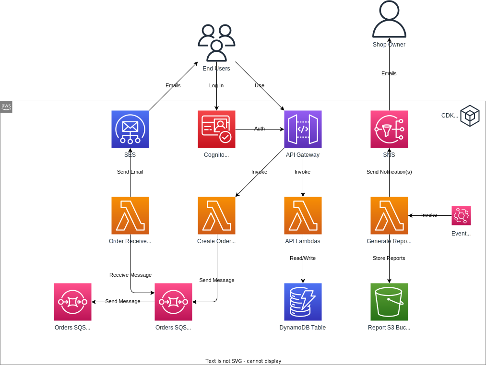

# EventBridge Rules, S3 Storage, and SNS Topics

**Goal:** Design a mechanism to produce daily reports of orders, store these reports in an Amazon S3 bucket, and notify the store owner using Amazon SNS.

## Required Reading

- [Creating an Amazon EventBridge rule that runs on a schedule](https://docs.aws.amazon.com/eventbridge/latest/userguide/eb-create-rule-schedule.html)
- [What is Amazon S3?](https://docs.aws.amazon.com/AmazonS3/latest/userguide/Welcome.html)
- [How to use puppeteer with AWS Lambda](https://www.cloudtechsimplified.com/puppeteer-aws-lambda/)
- [Tutorial: Using an Amazon S3 trigger to invoke a Lambda function](https://docs.aws.amazon.com/lambda/latest/dg/with-s3-example.html)
- [Sharing objects with presigned URLs](https://docs.aws.amazon.com/AmazonS3/latest/userguide/ShareObjectPreSignedURL.html)
- [Sending Email Notifications with Amazon SNS](https://mailtrap.io/blog/amazon-sns-guide/)

## Online Shop

### DynamoDB Adjustments

Overload GSI1 to support querying for orders placed after a specified date (e.g., GSI1PK = "ORDERSBYDATE", GSI1SK = "ORDERDATE#2023-10-01"). Write a DynamoDB migration to populate this overloaded GSI. 

### S3 Setup & Report Generation

- **S3 Bucket Creation**: Establish a new S3 bucket for storing daily order reports.
- **EventBridge Rule**: Set up a schedule-driven rule using EventBridge to invoke a new Lambda daily.
- **Lambda Configuration**: The invoked Lambda should:
   - Query the DynamoDB table to retrieve all orders from the previous day.
   - Generate a PDF report, aggregating all products required to fulfill these orders, categorized by: Customer, Address, Product, and Quantity.
   - Use Handlebars to craft an HTML template of the report.
   - Utilize Puppeteer to convert this HTML template into a PDF format.
   - Store this PDF report into the S3 bucket, with a naming convention based on the current date/time.

You can find a HTML template for the report in the `templates` directory of this repository.

### SNS Configuration & Notification

- **SNS Topic Creation**: Create a new SNS topic.
- **Subscription**: Subscribe the store owner's (your) email to this topic. Verify it works by manually dispatching a test notification.
- **S3 Lambda Trigger**: Configure a Lambda function to get invoked when a new PDF report is uploaded to the S3 bucket. This Lambda:
   - Constructs a presigned URL pointing towards the new S3 object.
   - Sends an SNS notification embedding this presigned URL, ensuring the store owner receives an email containing the report link.

You can find a plan text template for the SNS notification in the `templates` directory of this repository.

### Testing

1. **Schedule Alteration**: Temporarily modify the EventBridge schedule to trigger more frequently (to test it more easily).
2. **Validation**: Ensure that the entire process, encompassing report generation, its storage, and subsequent notification to the store owner, works properly.

## Further Resources

- [Tutorial: Schedule AWS Lambda functions using EventBridge](https://docs.aws.amazon.com/eventbridge/latest/userguide/eb-run-lambda-schedule.html)
- [Node.js — Create a PDF from HTML with Puppeteer and Handlebars](https://futurestud.io/tutorials/node-js-create-a-pdf-from-html-with-puppeteer-and-handlebars)
- [Best Practices for Secondary Indexes with DynamoDB](https://www.trek10.com/blog/best-practices-for-secondary-indexes-with-dynamodb)
- [How to set up an Amazon S3 Bucket using AWS CDK](https://towardsthecloud.com/aws-cdk-s3-bucket)
- [AWS SNS: Getting started](https://docs.aws.amazon.com/sns/latest/dg/sns-getting-started.html)
- [AWS SNS: Email notifications](https://docs.aws.amazon.com/sns/latest/dg/sns-email-notifications.html)
