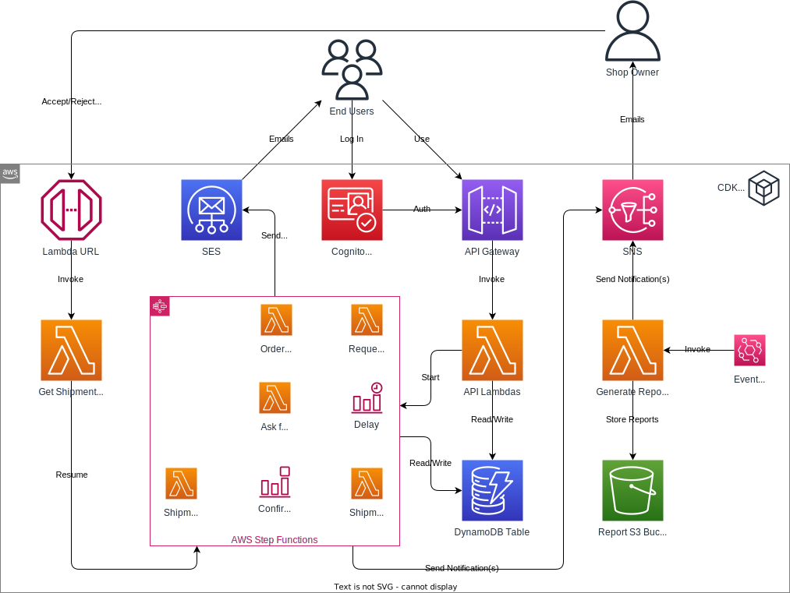

# Step Functions and Lambda Function URLs

**Goal:** Implement a workflow in AWS Step Functions to manage a multi-phase order process, integrating a manual approval phase using Lambda URLs.

## Required Reading

- [What is AWS Step Functions?](https://docs.aws.amazon.com/step-functions/latest/dg/welcome.html)
- [Creating a Step Functions state machine that uses Lambda](https://docs.aws.amazon.com/step-functions/latest/dg/tutorial-creating-lambda-state-machine.html)
- [Deploying an Example Human Approval Project](https://docs.aws.amazon.com/step-functions/latest/dg/tutorial-human-approval.html)
- [Lambda function URLs](https://docs.aws.amazon.com/lambda/latest/dg/lambda-urls.html)

## Online Shop

### State Machine

Create a new Step Functions State Machine using CDK. Modify the existing order creation Lambda function to trigger a new execution of this Step Functions State Machine whenever an order is placed.

### Workflow Steps

- **Order Confirmation Email**: As done before, immediately upon order placement, dispatch an "order received" confirmation email to the customer.
- **Shipment Approval Request**: Use Amazon SNS to notify the store owner, prompting them for an order shipment approval.
- **Timeout/Rejection Handling**:
   - If the store owner doesn't approve the order shipment within a specified time frame, or outright rejects it:
     - Delete the order from DynamoDB.
     - Notify the customer via email about the order cancellation.
     - Stop the Step Functions workflow execution.
- **Shipment Confirmation**: On receiving shipment approval, send an email via SES to the customer, informing them of the shipment.
- **Feedback Request**: After sending this email, put the workflow on hold for a predetermined period (e.g., 1 day). Once this period elapses, email the customer asking for feedback on their order.

You can find templates for the emails and the SNS notification in the `templates` directory of this repository.

### Lambda URL for Manual Approval

To handle the collection of shipment approval or disapproval from the store owner, set up a Lambda function configured with a Lambda URL. This URL serves as a callback, allowing the store owner to conveniently and directly interact with the Step Functions workflow. This Lambda will need to receive via query parameters at least the task token and the result.

Add logic in the Lambda and State Machine to handle both approval and rejection responses from the store owner:
- **Approval**: Advance the workflow to the "Shipment Confirmation" flow.
- **Rejection**: Advance the workflow to the "Timeout/Rejection Handling" flow.
   
### Testing

1. **Order Placement**: Simulate an order placement to initiate the Step Functions workflow.
2. **Approval Test**: Click on the Lambda URL sent via the SNS topic to the store owner to approve the order. Confirm the appropriate workflow transitions and email notifications.
3. **Rejection Test**: Using the same method, reject an order and validate the workflow's response.

## Further Resources

- [Tutorial: Creating a Lambda function with a function URL](https://docs.aws.amazon.com/lambda/latest/dg/urls-tutorial.html)
- [Using callback URLs for approval emails with AWS Step Functions](https://aws.amazon.com/blogs/aws/using-callback-urls-for-approval-emails-with-aws-step-functions/)
- [Using Step Function Task Tokens with CDK](https://aws.hashnode.com/using-step-function-task-tokens-with-cdk)
