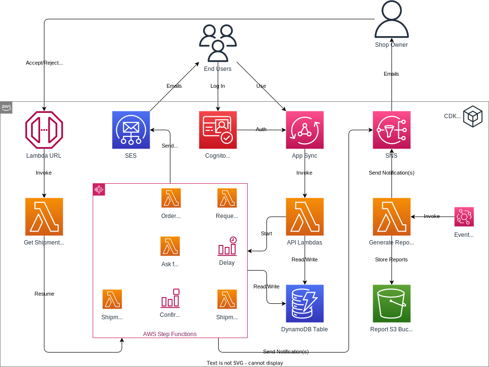

# GraphQL APIs using AppSync

**Goal:** Develop a GraphQL API for the online shop.

## Required Reading

- [Getting started: Creating your first GraphQL API](https://docs.aws.amazon.com/appsync/latest/devguide/quickstart.html)
- [Designing GraphQL APIs](https://docs.aws.amazon.com/appsync/latest/devguide/designing-a-graphql-api.html)
- [Tutorial: Lambda resolvers](https://docs.aws.amazon.com/appsync/latest/devguide/tutorial-lambda-resolvers.html)
- [AppSync: Authorization and authentication](https://docs.aws.amazon.com/appsync/latest/devguide/security-authz.html#amazon-cognito-user-pools-authorization)

## Online Shop

### Schema Design

Start by designing a GraphQL schema that encapsulates the functionality described in prior chapters. This schema should include at least:

- Types for each entity like products, suppliers, orders, customers, and admins.
- Queries to fetch data, such as retrieving all products, a specific supplier, or all products associated with a particular supplier.
- Mutations for creating, updating, and deleting records, like placing an order or adding a new product.

### AppSync Integration with CDK

- **Setting Up**: Initialize a new AppSync API through CDK, ensuring that the designed GraphQL schema is appropriately referenced.
- **Resolver Choice**: 
   - For basic CRUD operations, you can opt for either Lambda resolvers or JavaScript resolvers based on their support status in CDK (check the further resources below).
   - DO NOT use VTL-based DynamoDB resolvers.
   - For more intricate operations entailing business logic (like the order placement flow), implement Lambda resolvers.
   - Stick to a single Lambda function per individual query or mutation.
- **Authorization Mechanism**: 
   - Implement the `AMAZON_COGNITO_USER_POOLS` authorization model for the GraphQL API.
   - Utilize the `cognito_groups` AppSync directive parameter to apply the role-based access rules outlined in the Cognito chapter. 

### Testing 

1. **CRUD Operations**: Test creating, reading, updating, and deleting for each entity.
2. **Authorization**: 
   - Ensure only admins can create/update/delete products.
   - Validate that customers can place orders.
   - Confirm unauthorized operations return appropriate error messages.

## Further Resources

- [Building Scalable GraphQL APIs on AWS with CDK, TypeScript, AWS AppSync, Amazon DynamoDB, and AWS Lambda](https://aws.amazon.com/blogs/mobile/building-scalable-graphql-apis-on-aws-with-cdk-and-aws-appsync/)
- [How to design a kick-ass GraphQL schema](https://javascript.plainenglish.io/how-to-design-a-kick-ass-graphql-schema-79d573e85147)
- [JavaScript resolvers overview](https://docs.aws.amazon.com/appsync/latest/devguide/resolver-reference-overview-js.html#additional-utilities)
- [AppSync: JS Resolvers do not support code bundled in custom bundling environment](https://github.com/aws/aws-cdk/issues/24548)
