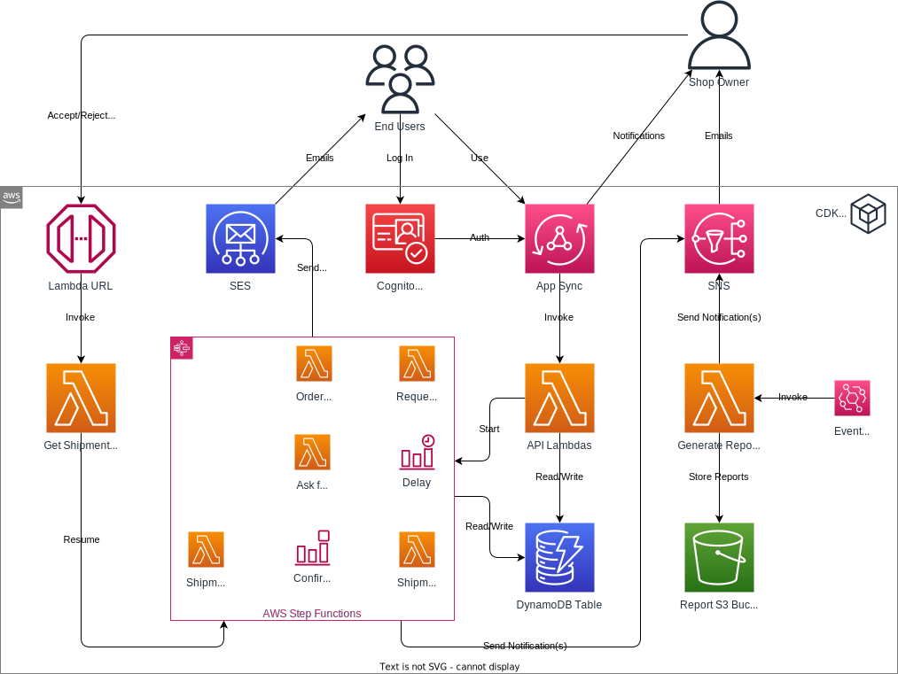

# Real-time APIs using AppSync

**Goal:** Develop a GraphQL real-time API to alert admins about incoming orders.

## Required Reading

- [AppSync: Real-time data](https://docs.aws.amazon.com/appsync/latest/devguide/aws-appsync-real-time-data.html)
- [AppSync: Enhanced subscription filtering](https://docs.aws.amazon.com/appsync/latest/devguide/aws-appsync-real-time-enhanced-filtering.html)

## Online Shop

### Adjusting the Order Mutation

**Calculating Total Price**: Adjust the GraphQL mutation designated for order placement; the linked Lambda function, upon receiving an order, should:
- Iterate through each product in the order.
- Multiply each product's price by its quantity.
- Sum up these individual totals to calculate the overall order price.
- Return this total price as part of the mutation response.

### Implementing Real-time Notifications

- **GraphQL Subscription**: Design a new GraphQL subscription named `onNewOrder`. This subscription will get triggered each time the order placement mutation is invoked.
- **Enhanced Filtering**: To offer a more tailored notification system:
   - Integrate a "minimum price" parameter into the subscription.
   - Use this parameter to screen out orders below a the given threshold, ensuring that admins only receive notifications for orders that exceed this minimum price.
- **Authorization**: Utilizing the AppSync's built-in authorization features:
   - Ensure that only Admin users can access and subscribe to the `onNewOrder` subscription.
   - Utilize Cognito user groups to verify if the authenticated user is part of the Admin group.
- **Notification Content**: When the subscription triggers:
   - Return essential order details like the order ID, total price, and the list of products.
   - This enables admins to promptly review and process the order.

### Testing

- Using the AppSync console or an appropriate GraphQL client, authenticate as an Admin user.
- Subscribe to the `onNewOrder` notification, specifying a minimum price threshold.
- From another session, place an order as a customer.
- Verify that the order notification is only received for orders above the set threshold.

## Further Resources

- [Create real-time applications via serverless WebSockets with new AWS AppSync GraphQL subscriptions filtering capabilities](https://aws.amazon.com/blogs/mobile/appsync-enhanced-filtering/)
